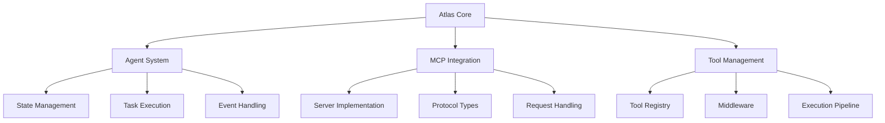

# Atlas Framework

A powerful framework for building AI agents using the Model Context Protocol (MCP).

[](https://opensource.org/licenses/MIT)

## Overview

Atlas is a Rust-based framework that provides a robust foundation for building AI agents that can interact with various tools and resources through the Model Context Protocol. It emphasizes:

- 🚀 High Performance: Built with Rust for optimal speed and memory efficiency
- 🛡️ Type Safety: Strong type system and compile-time guarantees
- 🧩 Modularity: Composable components and extensible architecture
- 🔌 MCP Integration: First-class support for the Model Context Protocol

## Features

- **Agent System**
  - Flexible agent architecture
  - State management
  - Event handling
  - Task execution

- **MCP Server**
  - Tool registration and execution
  - Resource management
  - HTTP/WebSocket interface
  - Request/response handling

- **Tool Management**
  - Tool registry
  - Middleware support
  - Execution pipeline
  - Input validation

- **State Management**
  - Memory system
  - State persistence
  - Task tracking
  - Event logging

## Installation

Add Atlas to your project's dependencies:

```toml
[dependencies]
atlas-core = "0.1"
atlas-mcp = "0.1"
atlas-agent = "0.1"
```

## Quick Start

Here's a simple example of creating an agent with a calculator tool:

```rust
use atlas_agent::{Agent, AgentBuilder, Config};
use atlas_core::Metadata;
use atlas_mcp::MCPTool;

// Define a tool
#[derive(Clone)]
struct CalculatorTool;

#[async_trait::async_trait]
impl MCPTool for CalculatorTool {
    fn name(&self) -> &str {
        "calculator"
    }

    fn description(&self) -> &str {
        "A simple calculator tool"
    }

    async fn execute(&self, params: Metadata) -> anyhow::Result<Metadata> {
        let a = params.get::<f64>("a")?;
        let b = params.get::<f64>("b")?;
        
        let mut result = Metadata::new();
        result.insert("sum", a + b);
        Ok(result)
    }
}

// Create and use an agent
#[tokio::main]
async fn main() -> anyhow::Result<()> {
    let agent = AgentBuilder::new()
        .config(Config {
            name: "calculator_agent".to_string(),
            description: Some("Agent that performs calculations".to_string()),
            capabilities: vec!["calculator".to_string()],
            config: Metadata::new(),
        })
        .tool("calculator", CalculatorTool)
        .build()?;

    let mut params = Metadata::new();
    params.insert("tool", "calculator");
    params.insert("a", 5.0);
    params.insert("b", 3.0);

    let result = agent
        .execute_task(atlas_core::TaskId::new(), params)
        .await?;

    println!("Result: {}", result.get::<f64>("sum").unwrap());
    Ok(())
}
```

## Architecture

Atlas is built around three main components:



### Core Components

1. **Atlas Core**
   - Base traits and types
   - Error handling
   - Common utilities

2. **Atlas MCP**
   - MCP server implementation
   - Tool and resource management
   - Request/response handling

3. **Atlas Agent**
   - Agent implementation
   - State management
   - Tool integration

## Examples

Check out the examples directory for more detailed examples:

- `simple_agent.rs`: Basic agent with calculator functionality
- `mcp_server.rs`: Custom MCP server with tools and resources

## Development

### Building

```bash
# Build all crates
cargo build

# Run tests
cargo test

# Run examples
cargo run --example simple_agent
cargo run --example mcp_server
```

### Project Structure

```
atlas/
├── crates/
│   ├── atlas-core/     # Core traits and types
│   ├── atlas-mcp/      # MCP server implementation
│   └── atlas-agent/    # Agent implementation
├── examples/           # Example code
└── tests/             # Integration tests
```

## Contributing

Contributions are welcome! Please feel free to submit a Pull Request.

1. Fork the repository
2. Create your feature branch (`git checkout -b feature/amazing-feature`)
3. Commit your changes (`git commit -m 'Add some amazing feature'`)
4. Push to the branch (`git push origin feature/amazing-feature`)
5. Open a Pull Request

## License

This project is licensed under the MIT License - see the [LICENSE](LICENSE) file for details.

## Acknowledgments

- [Model Context Protocol](https://github.com/modelcontextprotocol/protocol) for the MCP specification
- The Rust community for excellent tools and libraries
